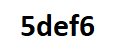
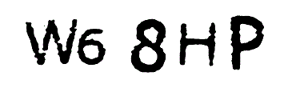

# Captcha-decoder

## Description : 
This script can decode weak captchas. It is intended to deter you fom using such weak systems by showing you that is possible to hijack them in a short period of time by using some basic programming knowledges. **I did this for learning purposes and encourage you to do the same!**

## Prerequisites before running the script :

 1. Install python 3 
 2. Install tesseract (https://github.com/tesseract-ocr/tesseract/wiki/Downloads)
	 2.a. if you are in windows make sur that the path is correct in the captcha.py file ***pytesseract.pytesseract.tesseract_cmd = 'C:/Program Files (x86)/Tesseract-OCR/tesseract'***
 3. Install PIL and pytesseract 
	 ```
	 sudo apt-get -y install python3-pip
	 pip3 install  Pillow
 	 pip3 install pytesseract 
	```

## How to use it :

Juste change the variable ***CAPTCHA_NAME*** by your image name. 
If the output is not correct then change the variable ***ZOOM*** or ***CONTRAST***
If you want to test it before, then I put in the images directory differents images with different level of difficulty :

<b>level 1 :</b>
<br />
<hr>
<b>level 2 :</b>
<br />
<hr>
<b>level 3 :</b>
<br />
<hr>
<b>level 4 :</b>
<br />
<hr>
<b>level 5 :</b>
<br />
