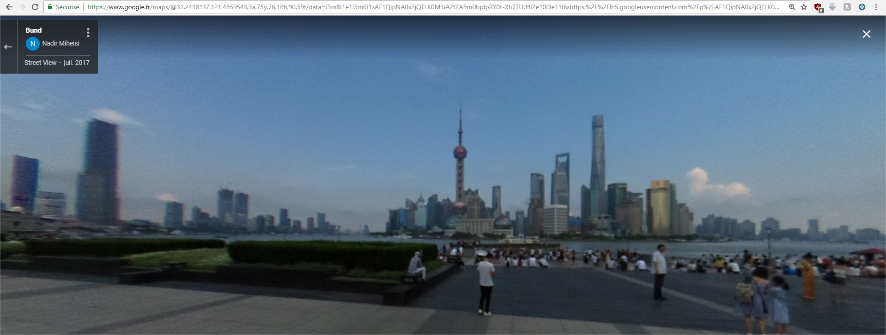

# Description :

This script allows you to extract metadata of an image

# Prerequisites :

```
pip3 install exifread
```

# How to use it :

## usage :

```shell
python3 metadata.py data.jpg
```

***Example of GPS output:***

```
GPS INFO :
Latitude: 31.241880555555557 | Longitude: 121.48606666666667
```

- Source image:

  

- Google search with my Latitude and Longitude :

  

