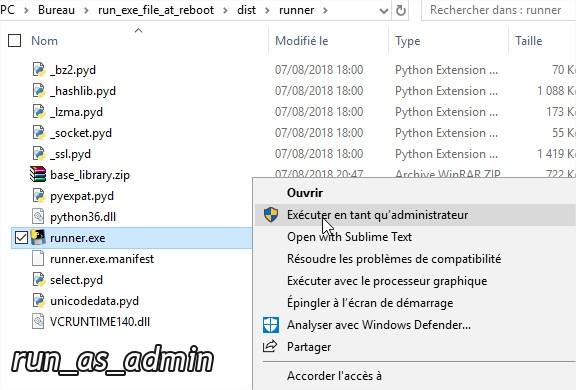
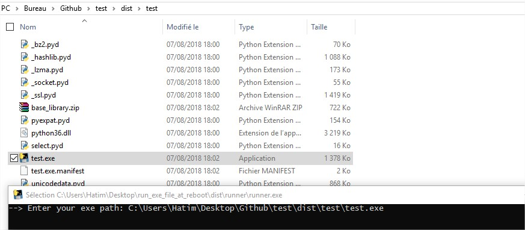

# Description :
This script launches an executable during each reboot. **I did this for learning purposes and encourage you to do the same!**

# Before running the script :
**- This programm works only on windows OS**

**-  you must run the script as an administrator. The problem is that I have not managed to find a way to run a python file as an administrator, the alternative to solve this obstacle is to turn this python script into an executable file (.exe) using this command for example :**

```
pip install pyinstaller
pyinstaller runner.py
```

# How to use it :

1) run the script as admin


2) Enter full path of your exe file


## proof

